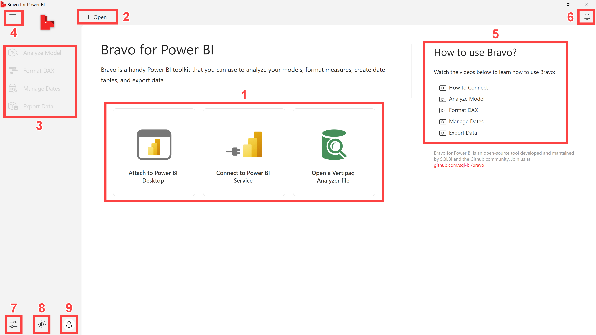
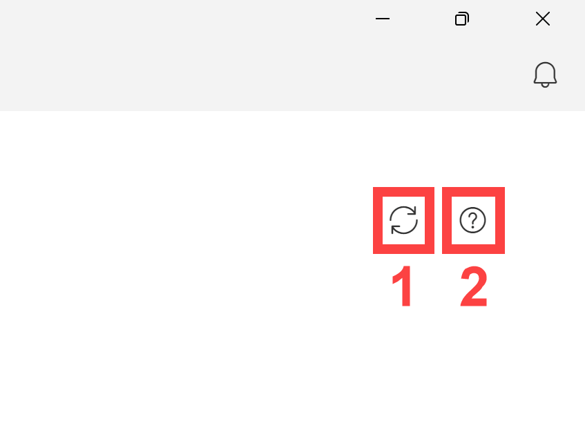
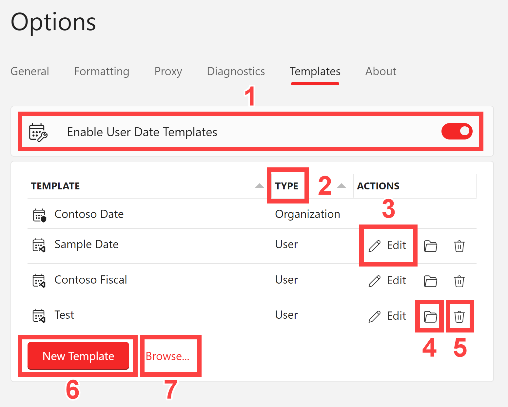
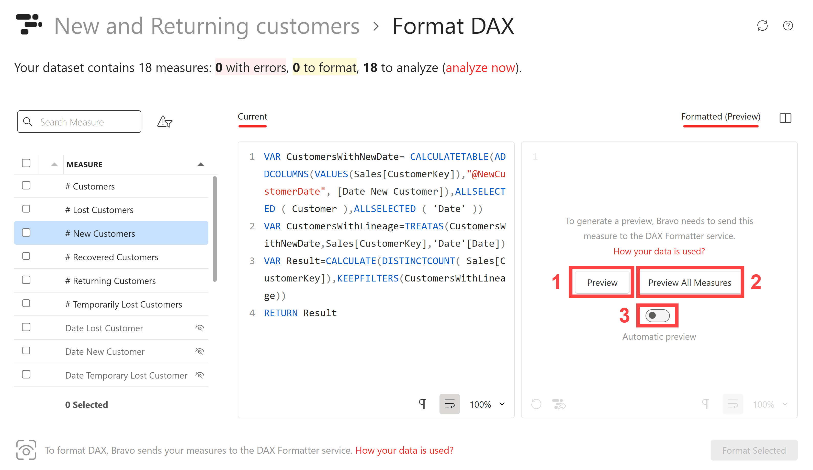

# Introduction
Bravo for Power BI helps you author a Power BI model:
- [**Analyze Model**](#analyze-model): find the more expensive columns and tables.
- [**Format DAX**](#format-dax): format existing DAX measures.
- [**Manage Dates**](#manage-dates): create a Date table and apply time intelligence functions to existing measures.
- [**Export Data**](#export-data): export data from Power BI to Excel and CSV files.

## Installation
Bravo installation provides different options.

The setup programs are available in two categories:
- **Self-contained**: The self-contained portable setup options include the .NET runtime required for the installation. The presence of the .NET runtime increase the size of the setup, but it gurantees that all the required components are installed if necessary.
- **Framework-dependent**: The setup does not include the required .NET runtime. The setup is smaller, but it will fail if the required .NET runtime framework is not already installed on the target computer.

For each cateory, we have the following variations:
- **Default setup**: requires administrative rights and installs Bravo as an External Tool for Power BI Desktop.
- **User**: does not require administrative rights, but it does not install Bravo as an External Tool in Power BI Desktop.
- **Portable**: there is not setup; just extract the ZIP file content into a local folder and run Bravo straight from the executable included in that folder.

[Download and install the latest version](https://github.com/sql-bi/Bravo/releases/latest) from GitHub.

## User interface

Bravo has a user interface based on a single window that allow multiple connections.

1. Create a **connection** to a model in Power BI, or load a VertiPaq Analyzer file. 
2. Open a **new connection**
3. **Operations** available on the selected connection. They are all disabled where there are no open connections. Each operation is applied to the tab that is currently active. 
4. **Collapse or expand** the operations pane.
5. Open **documentation and help videos**.
6. Open the **Alert pane** that shows important messages like new updates available.
7. Open the **Options dialog box** to specify all the settings for Bravo.
8. **Theme selection**: Switch beween light theme, dark theme, or automatic. The default setting is automatic, which chooses between light mode and dark mode based on Windows settings.
9. **Login** to the Power BI service, required to connect Bravo to a dataset published on Power BI service. The first time, Bravo may request the username to locate the right endpoint for the authentication. During the sign in, a browser window appears to complete the login process. Login is not required to access local files. Bravo remembers log in credentials on following runs, just like Power BI Desktop does: use the same button to explicitly **Logout**. 

Other two common elements of the user interface appear in all the operation pages.

1. **Synchronize**: Synchronize the information in Bravo with the information in Power BI Desktop. For example, if you add a measure or import a new table, you can update the information in Bravo by clicking the “Synchronize” button.
2. **Help**: Open a browser window pointing to the documentation.

## Options

The Options dialog box includes the settings for all the features available in Bravo for Power BI.
The settings are stored per user and are preserved when Bravo is updated.

### General
- **Theme**: Set the theme of the user interface:
    - *Light*: Light background
    - *Dark*: Dark background
    - *System*: Use light or dark depending on the Windows settings
- **Language**: Language of the user interface. By changing this setting Bravo must restart and closes existing connections.
- **Restore Alerts**: By clicking *Restore*, hidden alerts are restored in a visible state. The *Restore* button is available when one or more alerts have been ignored by the user.
- **Power BI Account**: When the user is not logged in, the *Sign In* button can start the sign in process to Power BI service. When the user is already logged in, the *Sign Out* link can disconnect from Power BI service.
- **Authenticate in Browser**: When enabled, use the default browser to complete the authentication process. This option can be helpful in case the standard login method does not work correctly with two-factor authentication.
### Formatting
- **Automatic Preview**: Enable/disable the automatic preview for [Format DAX](#format-dax)
- **Separators**: Set the separators used for the DAX code:
    - *Auto*: Automatic choice of the separators based on heuristic search.
    - *A, B, C, 1234.00*: Use comma (,) as list separator and dot (.) as decimal separator.
    - *A; B; C; 1234,00*: Use semicolon (;) as list separator and comma (,) as decimal separator.
- **Lines**: Line style:
    - *Long lines*: Keep the minimum amount of code in each line.
    - *Short lines*: Try to keep in the same line an entire DAX expression.
- **Spacing**: Use of space after function names:
    - *Best practice*: Always use the best practice suggested by DAX Formatter.
    - *Space - IF (*: Include a space between the function name and the bracket.
    - *No space - IF(*: Put the bracket just after the function name, without any space.
- **Name-Expression Breaking**: Control where to start the formatted code in Power BI.
    - *Same Line*: Keep the formatted code in the same line as the measure name in Power BI. This is the style resulting from editing measures in Tabular Editor, which would display an initial blank line otherwise.
    - *Line Break*: Start the formatted code the line after the measure name in Power BI. This is the suggested style when the measures are edited in Power BI, which results in an initial blank line in Tabular Editor.
    - *Auto*: Automatically determine the style used in the model for the majority of the measures.
- **Include Time Intelligence**: If enabled, include in Format DAX also the Time Intelligence measures generated by [Manage Dates](#manage-dates). Because the templates usually generate code already formatted, this setting is disabled by default.
### Proxy
- **Proxy Server**: Specify a proxy to call external services, like telemetry, updates notification, and DAX Formatter.
    - *None*: Do not use any proxy server.
    - *System*: Use the proxy server defined in Windows settings.
    - *Custom*: Specify the proxy server to use.
- **Proxy Server Address**: *(only for Custom)* Specify the proxy server address.
- **Bypass Local Addresses**: *(only for Custom)* If enabled, to not use the proxy for local (intranet) addresses.
- **Exclude Address List**: *(only for Custom)* List of addresses to do not have to use the proxy server.
- **Custom Credentials**: *(only for System and Custom)* Custom user credentials for the proxy server.
### Diagnostics
- **Telemetry**: Control whether to send telemetry data to SQLBI. No personal information is collected.
- **Diagnostics Level**: Show errors and logs in a diagnostics pane in Bravo for Power BI window:
    - *None*: No diagnostic message.
    - *Basic*: Show only important messages.
    - *Verbose*: Show only important messages.
    
### Templates
The Templates tab controls the templates available in the [Manage Dates](#manage-dates).

A template package is a single JSON file that contains a user template (extension *.package.json*).

A template workspace is an entire folder hierarchy identified by a file with the extension *.code-workspace*.

1. **Enable User Date Templates** show custom user templates in [Manage Dates](#manage-dates)
2. The **Type** of the template can be:
    - *User*: Custom template that has imported in Bravo or has been created locally. More information in [Customize Date Template](customize-date-template.md).
    - *Organization*: template distributed by the organization through group policies. More information in [Deploy Organization Templates](deploy-organization-templates.md).
3. Use **Edit in Visual Studio Code** to open the template in Visual Studio. This button appears for user templates that are created locally or have been imported with the entire folder. This button does not appear for Organization templates and User templates imported using only the package distribution file.
4. Use **Show in File Explorer** to open the root folder for the user template. This button appears for user templates that are created locally or have been imported with the entire folder. This button does not appear for Organization templates and User templates imported using only the package distribution file.
5. Use **Remove** to remove a user template from the list. The template files are not deleted, use Show in File Explorer to open the folder before removing the template in order to delete the files.
6. Use **New Template** to create a new Date template based on a predefined template.
7. Use **Browse...** to import a template package or workspace.

### About
Show the Power BI version and provide update options:
- **Stable/Dev combo**: choose the distribution channel:
    - *Stable*: Less frequent updates with new features and bug fixes that users have already tested in the “Dev” channel.
    - *Dev*: more frequent updates; new features and bug fixes appear as soon as they are implemented. The “Dev” channel is like using a “beta” version of new software: it could be less stable, but issues are also resolved more quickly.
- **Automatically check for updates**: show an Alert when there is a new version available.
# Features

Features available in Power BI:
- [**Analyze Model**](#analyze-model): find the more expensive columns and tables.
- [**Format DAX**](#format-dax): format existing DAX measures.
- [**Manage Dates**](#manage-dates): create a Date table and apply time intelligence functions to existing measures.
- [**Export Data**](#export-data): export data from Power BI to Excel and CSV files.

## Analyze Model

Analyze Model shows the space consumed by columns in the model.

The purpose is to find where a model consumes memory in order to remove the more expensive columns that are not useful.

1. The highlighted **unreferenced columns** are columns not used in measures and relationships of the model. However, unreferenced columns could be used in reports. Make sure that they are unnecessary at the report level before removing them from the model.
2. The **Smaller columns...** link shows all the model columns, instead of showing only the five largest columns of the model by default.
3. **Group by Table** shows the columns grouped by table.
4. The **cardinality** value reports the number of rows in a table and the number of unique values in each column.
5. The **size** value represents the amount of memory consumed by each table and column.
6. **Save as VPAX** saves the information collected by Analyze Model into an external VPAX file. The VPAX file can be opened by Bravo, [DAX Studio](https://daxstudio.org/), [Tabular Editor](https://tabulareditor.com/), and [VertiPaq Analyzer](https://www.sqlbi.com/tools/vertipaq-analyzer/).
7. The **treemap** visualization shows the same memory size as an area.

The Group by Table visualization displays data in two levels: table and column.

1. Filter the displayed columns by typing partial column names in the **Search Column** textbox.
2. **Show unreferenced columns only** displays only unreferenced columns, hiding columns that are used by relationships and DAX expressions in the model.
3. **Expand all** expands all the table names, showing all the filtered columns for all the tables. The expand all does not remove the filter applied by the Search Column textbox.
4. **Collapse all** shows only table names, removing the detail of the columns. The size of each table only considers the columns filtered by the Search Column textbox.

Use Power BI Desktop to remove columns that are not useful after verifying that they are not used by any report. Remember that Bravo only check that columns are referenced within the model, but it cannot verify whether a column is used in a report.

## Format DAX
Bravo can format the DAX measures of a Power BI model.

1. Filter measures by writing a partial name in the **Search Measure** textbox.
2. **Current** shows the current DAX expressions of the selected measure.
3. **Formatted (Preview)** shows the preview of the formatted measure.
4. Show current and preview in **separate panes**. The button switches between overlapped panes, vertical side-by-side, and horizontal side-by-side.

When the *Formatted (Preview)* pane is visible, the DAX code must be sent to the [DAX Formatter](https://daxformatter.com) service to be formatted.

The preview requires a manual action because the DAX Formatter service must receive the DAX code. The DAX Formatter service does not store any received DAX code, but users must be aware that they are using a free online service provided by SQLBI.

1. **Preview** sends only the DAX measure displayed in the *Current* pane to the DAX Formatter service, and then displays the formatted code.
2. **Preview All Measures** sends all the measures of the model to the DAX Formatter service. The preview is then automatically displayed for any other measure selected for the current model without requiring a confirmation for each measure.
3. By enabling the **Automatic preview** setting, the preview is automatically enabled for all the measures of any model. The choice can be reverted in the [Options](#options) dialog box.

When the previes is enabled, the measures that are not formatted are highlighted in the list of the measures.
Bravo writes in the Power BI the formatted version only of the selected measures.

1. **Show unformatted measures** filters only the measures that are not formatted. This filter only works with measures that have the preview enabled. The same filter also includes measures that cannot be formatted because of a syntax error. The code of the measure cannot be modified in Bravo, the *Current* and *Formatted (Preview)* panes are read-only.
2. **Select/unselect all the measures** that Bravo writes in Power BI when the user clicks *Format Selected*.
3. **Select/unselect the measure** in the corresponding line. 
4. **Whitespaces** shows/hide a placeholder to identify whitespaces in the code.
5. **Auto word-wrap** shows the content of a long line within the visible code pane, splitting the code into multiple lines if necessary. When this happens, the line number at the left of the code clarifies the actual lines in the measure. Without Auto word-wrap, the horizontal scrollbar can show the remaining part of the line that is not visible in the code pane.
6. **Zoom** changes the font size of the code pane.
7. **Refresh preview** updates the formatted preview of a measure by invoking the DAX Formatter service. 
8. **Format online with DAX Formatter** shows the formatted measure in a browser window using the DAX Formatter website. From that page, the formatted measure can be copied to the clipboard or saved into a file.
9. **Format Selected** writes a formatted version of the selected measure in the Power BI model.

**IMPORTANT**: create a backup of the PBIX file before using Bravo, because it is not possible to “undo” the Format DAX operation!

## Manage Dates
<todo assign="marco">Complete this section</todo>

## Export Data
<todo assign="marco">Complete this section</todo>

# Feedback and support
Bravo is an open source project available on GitHub at [https://github.com/sql-bi/Bravo/](https://github.com/sql-bi/Bravo/).

You can contribute to Bravo in many ways:
- Submit [issues](https://github.com/sql-bi/Bravo/issues) you find bugs or have ideas for new features.
- Answer to questions made by other Bravo users in the [Discussions](https://github.com/sql-bi/Bravo/discussions) page.
- [Add or edit translations](https://github.com/sql-bi/Bravo#how-to-help-with-translations) in non-English languages.
- Write C# and TypeScript code for new features by forking the [Bravo GitHub repository](https://github.com/sql-bi/Bravo).