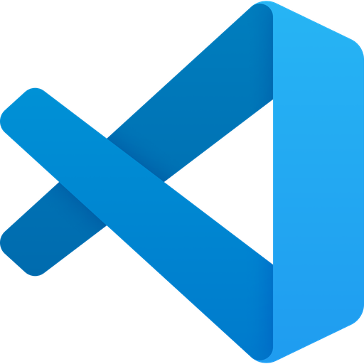

Ten clients from eight vendors can read and modify a semantic model while **Power BI Desktop** is open, and all of them do it through the same component: the **Power BI Authoring MCP server**, published by Microsoft as the npm package `@microsoft/powerbi-modeling-mcp` and started as a local process.

What changes between one client and another is the installation, the account it requires, the way the MCP server is declared, and the way each one asks for approval before it writes. Some of them also run the **Power BI report authoring skill**, which works on the report of a PBIP project.

This page collects the comparison that helps you pick one, and a self-contained setup guide for each client. Every guide starts from a machine where only Power BI Desktop is installed, and ends with an agent that writes a measure and, when the client supports it, a report page.

> The list is a snapshot of September 2026, and it is not a ranking. Product names and logos are trademarks of their respective owners. SQLBI is not affiliated with them.

## Choosing a client

[**AI hosts for Power BI Desktop: a comparison**](comparison.md) puts installation and account, registration of the MCP server, and support for the report authoring skill in three tables. It is the shortest way to choose before you start a setup.

## Setup guides

| | Vendor | Setup guides |
| --- | --- | --- |
|  | OpenAI | [The ChatGPT desktop app](chatgpt-desktop.md) [Codex CLI](codex-cli.md) |
|  | Anthropic | [Claude Code Desktop](claude-code-desktop.md) [Claude Code](claude-code.md) |
|  | Microsoft | [Visual Studio Code](vscode.md) |
|  | Microsoft | [Microsoft Copilot](microsoft-copilot.md) (*no setup guide yet) |
|  | GitHub | [GitHub Copilot CLI](github-copilot-cli.md) |
|  | Google | [Google Antigravity](antigravity.md) |
|  | SpaceXAI | [Grok Build](grok-build.md) |
|  | AWS | [Kiro](kiro.md) |
|  | Alibaba | [Qwen Code](qwen-code.md) |

<small>Product names and logos are trademarks of their respective owners. SQLBI is not affiliated with them.</small>

>> **Microsoft Copilot** is in the table for completeness, without a setup guide. As of September 2026 it does not create the objects of a semantic model in Power BI Desktop, so it cannot follow the exercises of the courses. [More details about the reasons, and what we will do when that changes](microsoft-copilot.md).

## What every setup has in common

- **Power BI Desktop** installed, and **write permission** on any semantic model the agent modifies. The MCP server follows the same rules as the Power BI external tools.
- **Node.js**, because the MCP server is started with `npx`.
- An account with the vendor of the client, on a plan that includes the use of MCP servers.
- The sample model used in all the guides: **[ContosoDemo10k.zip](https://www.sqlbi.com/wp-content/uploads/ContosoDemo10k.zip)**.

> Back up your model before an agent writes to it. With the sample model, extract the archive again if something goes wrong.
