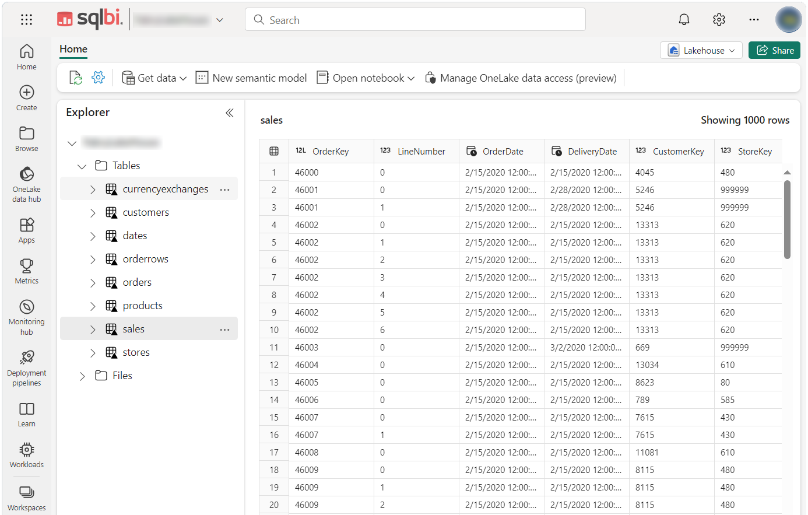

The Contoso Data Generator is a tool for generating sample data with randomly generated orders for the Contoso data model to provide demo data. Generated data is ready to be imported into Power BI, Fabric, and other platforms.

To consume the data, you can just download a [**ready to use sets of data**](https://github.com/sql-bi/Contoso-Data-Generator-V2-Data) generated by the tool.

If you want to create your customized set of data, you can get [Contoso Data Generator on GitHub](https://github.com/sql-bi/Contoso-Data-Generator-V2/). It is a c# program that generate the data plus additional scripts for simplifying the activity, importing data to sql-server, etc. 


Supported [output formats](formats.md):
 - Parquet
 - Delta Table (files)
 - CSV
 - CSV multi file
 - CSV multi file, gz compressed
 - Sql Server, via bulk-insert script of the generated CSV files

<br/> 

Delta Table output can be directly used in Fabric LakeHouse without any conversion:

<br/><br/>

## Usage

DataGenerator runs at command-line and requires four mandatory elements to run:
 - a configuration file (json)
 - a data file (excel)
 - an output folder
 - a cache folder
 - [optional parameters]

```
databasegenerator.exe  configfile  datafile  outputfolder  cachefolder   [param:AAAAA=nnnn] [param:BBBBB=mmmm]
```
Example:

```
databasegenerator.exe  c:\temp\config.json  c:\temp\data.xlsx  c:\temp\OUT\  c:\temp\CACHE\
```

To simplify running the tool, [a set of scripts](scripts.md) is available.

**Note**: The tool needs some files containing static data: fake customers, exchange rates, postal codes, etc. The files are cached after being downloaded over the Internet from a specific GitHub repository. [More details](details.md).

## Previous versions
The current version of this tool is the evolution of the first Contoso Data Generator, still available on GitHub:
- [Previous version (v1)](https://github.com/sql-bi/Contoso-Data-Generator)

 