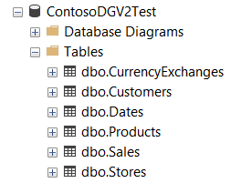

# Scripts for importing data into SQL Server

The set of scripts under `scripts/sql` allow you to import CSV output files to a Sql Server database. The scripts create the required tables, indexes and relationship and import data using sql bulk insert. The underlying SQL scripts are executed using SQLCMD from the command line.

## Sql_ImportData.cmd

**Warning**: on every run, the script deletes and recreates the tables from scratch. Be careful: do not point the script to a production database or to a database in which you already have data. **You risk to lose the existing data**.

Steps:
 - Create the set of data, as CSV files, as usual.
 - Copy the output files under `scripts/sql/inputcsv` 
 - Adapt the script to your SQL server instance. SQLCMD requires SQL Server name and other parameters to connect to an SQL Server instance. The script defaults are: 
 `sqlcmd -S (LocalDb)\MSSQLLocalDB -d ContosoDGV2Test`
 - Run the import script. When asked, choose what to import:
    - sales : Manages base tables + sales table
    - orders : Manages base tables + orders/order-rows tables
    - both: Manages base tables + sales/orders/order-rows tables

Resulting database:

## SQLBI_ALL_DB.cmd

Specific scripts used by SQLBI for creating SQL Server database backups. It is available in the ready-to-use repository.
The database are: Contoso V2 10k, Contoso V2 100k, Contoso V2 1M, Contoso V2 10M, and Contoso V2 100M.

 - `SQLBI_ALL_DB.cmd` : import data into the 4 databases, backup them and compress the resulting file.
 - `SQLBI_CreateSqlDatabases.ps1` : creates the 4 databases on the specified SQL Server