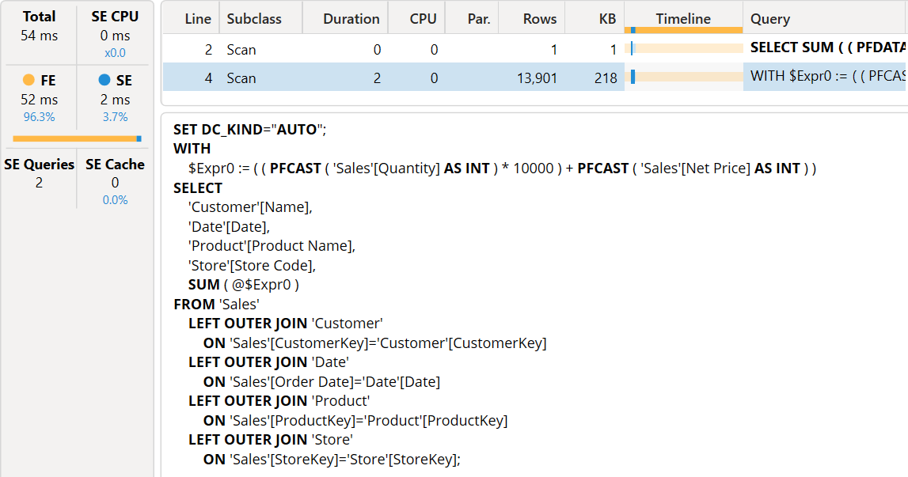
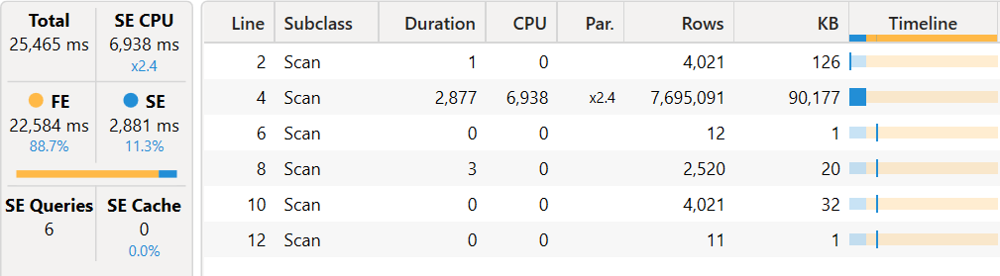

The SWITCH function is syntax sugar for a list of nested IF conditions. Because SWITCH translates into IF and does not have an equivalent for IF.EAGER, the only way to get an eager evaluation for SWITCH is by using variables.

## External resources
[**Understanding the optimization of SWITCH**](https://www.sqlbi.com/articles/understanding-the-optimization-of-switch/) describes how SWITCH can remove branches of query plans for the formula engine depending on the expressions tested.

[**Optimizing IF and SWITCH expressions using variables**](https://www.sqlbi.com/articles/optimizing-if-and-switch-expressions-using-variables/) explains how to correctly use variables in SWITCH to get the benefits of the SWITCH optimization. The opposite corresponds to the behavior of an IF.EAGER that forces the evaluation of all the branches in advance.

[**Optimizing SWITCH on slicer selection with Group By Columns**](https://www.sqlbi.com/articles/optimizing-switch-on-slicer-selection-with-group-by-columns/) explains how to optimize the SWITCH condition whe it reads a Power BI slicer selection.

## Unsupported cases
There are case where the SWITCH optimization is not triggered, or when the presence of the SWITCH function (or an equivalent list of nested IF) produces negative side effects on performance.

### Expressions with operators
The result of a IF or SWITCH function can be assumed to be a non-blank value for the crossjoin generated by SUMMARIZECOLUMNS when the expression in the conditional branch is not a single aggregation.
The following queries run on [SWITCH slow execution in SUMMARIZECOLUMNS](https://www.sqlbi.com/wp-content/uploads/SWITCH-slow-execution-in-SUMMARIZECOLUMNS.zip)

In the following DAX query, only nodes with a single SUMX can be optimized (AUD case is related to an implicit data type cast operator described later in [Implicit data type cast operator](#implicit-data-type-cast-operator)).

```DAX
DEFINE
    MEASURE Sales[Test1] =
        SWITCH (
            SELECTEDVALUE ( 'Currency'[ToCurrency] ),
            -- USD produces a crossapply (slow)
            "USD", SUMX ( Sales, Sales[Quantity] * Sales[Net Price] ) - SUMX ( Sales, Sales[Quantity] * Sales[Unit Cost] ),
            -- EUR produces a single SE query for the result (fast)
            "EUR", SUMX ( Sales, Sales[Quantity] * (Sales[Net Price] - Sales[Unit Cost] ) ),
            -- CAD produces a crossapply (slow)
            "CAD", SUM ( Sales[Quantity] ) + SUM ( Sales[Quantity] ),
            -- AUD produces a crossapply (slow) becaust of an implicit cast
            "AUD", SUMX ( Sales, Sales[Quantity] + Sales[Quantity] ),
            -- GBP produces a single SE query for the result (fast)
            "GBP", SUMX ( Sales, Sales[Quantity] + Sales[Net Price] )
        )
    VAR _FilterCurrencyTest1 =
        TREATAS ( { "GBP" }, 'Currency'[ToCurrency] )

EVALUATE
SUMMARIZECOLUMNS (
    Customer[Name],
    'Date'[Date],
    'Product'[Product Name],
    Store[Store Code],
    _FilterCurrencyTest1,
    "Test1", [Test1]
)
```

Ideally, SUMMARIZECOLUMNS only produces the existing combinations of Customer/Date/Product/Store according to data filtered in Sales. This happens only for expressions that have a simple aggregation (EUR and GBP conditions). It should happen also for AUD, but in that case the assumption is broken because of the implicit data type cast operator.

The following query plan is obtained for both EUR and GBP applied as filters to *Currency\[ToCurrency\]*: the **CrossApply** operator implements the Sum_Vertipaq aggregation.


The server timings pane confirms that there is a single storage engine query (at line 4) to solve the DAX query (the first xmSQL at line 2 is the query to retrieve the SELECTEDVALUE result).


If we use CAD as a filter, we get a much longer query plan. The CrossApply operator in this case implements a CrossApplyInteger operation (even though there are no differences in the logical query plan).


The additional storage engine queries are not a big deal unless they materialize many rows, but the real issue is that the full crossjoin executed in the formula engine can be extremely expensive in the formula engine.


For example, with 7,695,091 existing combinations, the full cartesian product of 12 * 2,520 * 4,021 * 11 generates 1,337,545,440 combinations in the formula engine, only to ignore all of them that are not included in the existing combinations.


The full cartesian product seems generated for any operator. Only when the complete conditional branch (expression executed by IF/SWITCH) has a single aggregation, we have a better optimization.

In this condition, there is a significative advantage in creating a measure that executes all the operations in a single aggregation (over the same fact table aggregated by SUMMARIZECOLUMNS) rather than summing different aggregations.
For example, the following operations produce a full crossjoin evaluation in the formula engine:
```DAX
SUM ( t[c1] ) + SUM ( t[c2] )
SUMX ( t, t[c1] * t[c2] ) + SUMX ( t, t[c3] * t[c4] )
```
Whereas the following corresponding operation can produce an optimal plan from a formula engine perspective:
```DAX
SUMX ( t, t[c1] + t[c2] )
SUMX ( t, t[c1] * t[c2] + t[c3] * t[c4] )
```
However, the latter version may be slower than the original code from a storage engine perspective. Finding the optimal balance depends on the difference between the requested crossjoin and the resulting existing combinations. 

It is hard to predict which case favor another, because it really depends on the report. The problem becomes visible in visuals that combine many groupby columns from different tables.

### Implicit data type cast operator

In the previous example, the branch for AUD does not produce the optimal formula engine query plan and generates a full crossjoin, even if the the expression matches the pattern that should be optimized (single aggregation, SUMX).

The reason is that the entire SWITCH function must have a single data type as a result, and that result is a CURRENCY (CURRENCY takes precedence over INTEGER when there are different data types; if present, DOUBLE would take precedence over CURRENCY and INTEGER)

```DAX
    MEASURE Sales[Test1] =
        SWITCH (
            SELECTEDVALUE ( 'Currency'[ToCurrency] ),
            -- USD returns CURRENCY
            "USD", SUMX ( Sales, Sales[Quantity] * Sales[Net Price] ) - SUMX ( Sales, Sales[Quantity] * Sales[Unit Cost] ),
            -- EUR returns CURRENCY
            "EUR", SUMX ( Sales, Sales[Quantity] * (Sales[Net Price] - Sales[Unit Cost] ) ),
            -- CAD returns INTEGER
            "CAD", SUM ( Sales[Quantity] ) + SUM ( Sales[Quantity] ),
            -- AUD returns INTEGER
            "AUD", SUMX ( Sales, Sales[Quantity] + Sales[Quantity] ),
            -- GBP returns CURRENCY
            "GBP", SUMX ( Sales, Sales[Quantity] + Sales[Net Price] )
        )
```

Because the result of the AUD expression is an INTEGER, there is an implicit data cast operator that breaks the SWITCH optimization and revert the behavior to the full crossjoin in the CrossApply operator we have seen before.

The solution is to apply an explicit conversion to CURRENCY (we use CONVERT, but the CURRENCY function would produce the same result):

```DAX
    MEASURE Sales[Test1] =
        SWITCH (
            SELECTEDVALUE ( 'Currency'[ToCurrency] ),
...
            -- AUD returns CURRENCY
            "AUD", SUMX ( Sales, CONVERT ( Sales[Quantity] + Sales[Quantity], CURRENCY ) ),
...
        )
```

This is a separate issue from the [expression with operator](#expressions-with-operators) case we described before, and they could be fixed separately by Microsoft in the future.

### Context transition
If the simple aggregations contains a context transition, the SWITCH evaluation in a SUMMARIZECOLUMNS performs the full crossjoin in the formula engine, as we have seen in the previous [Expressions with operators](#expressions-with-operators) section.

For example, this code produces a full crossjoin in the formula engine.


```DAX
    MEASURE Sales[selection] = 
        SELECTEDVALUE ( DisconnectedTable[column] )
    MEASURE Sales[Test1] =
        SWITCH (
            SELECTEDVALUE ( 'Currency'[ToCurrency] ),
...
            -- AUD returns CURRENCY
            "AUD", SUMX ( Sales, Sales[Quantity] * [selection] ),
...
        )
```

If the context transition is not required to evaluate a measure reference (e.g. SELECTEDVALUE from a slicer), then a variable is a possible workaround.

```DAX
    MEASURE Sales[selection] = 
        SELECTEDVALUE ( DisconnectedTable[column] )
    MEASURE Sales[Test1] =
        VAR _selection = [selection]
        RETURN 
            SWITCH (
                SELECTEDVALUE ( 'Currency'[ToCurrency] ),
...
                -- AUD returns CURRENCY
                "AUD", SUMX ( Sales, Sales[Quantity] * _selection ),
...
        )
```

