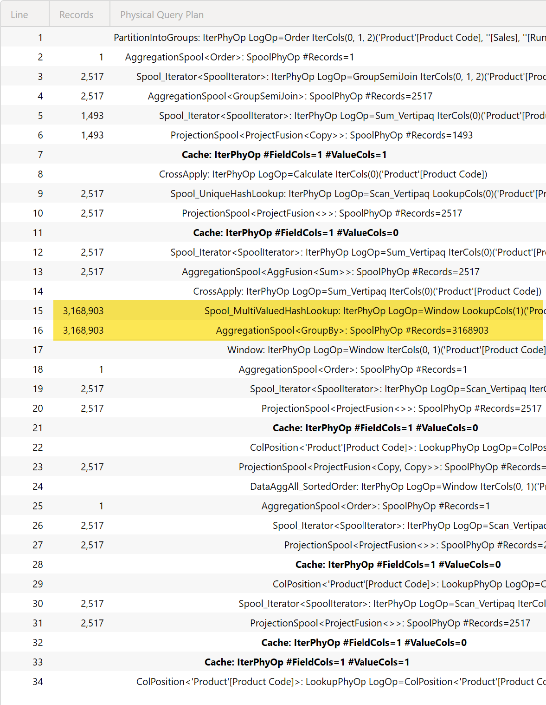
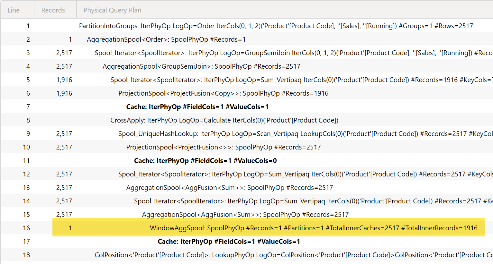

The WINDOW function has an optimization published on Power BI Service from December 2025 (not available on Power BI Desktop as of January 2026) that improves the formula engine performance of queries that use WINDOW over large datasets. Functions based on WINDOW benefit from this optimization, like RUNNINGSUM.
The optimization reduces the complexity from _O ( n * n )_ to _O ( n * log(n) )_ in typical scenarios.

## Conditions to apply the optimization
The optimization is applied when all the following conditions are met:
- The WINDOW function is used as a filter in CALCULATE or CALCULATETABLE.
- The expression computed is additive (i.e., SUM, COUNT, COUNTROWS, etc. and involved relationships can keep the additivity).

## Example
The following DAX expression can benefit from the WINDOW optimization:

```DAX
EVALUATE
SUMMARIZECOLUMNS ( 
    'Product'[Product Code],
    "Sales", [Sales Amount],
    "Running", 
        CALCULATE ( 
            [Sales Amount],
            WINDOW ( 1, ABS, 0, REL, ORDERBY ( 'Product'[Product Code] ) ) 
        )
)
ORDER BY 'Product'[Product Code]
```

The query plan without the optimization shows the _O ( n * n )_ complexity in the spool node below the CrossApply operator.


With the optimization enabled, the query plan shows a much more efficient plan that hides the internal implementation but results in _O ( n * log(n) )_ complexity. The presence of the optimization can be verified by the presence of the **WindowAggSpool** node in the physical query plan.


## Unsupported scenarios
The optimization is not applied on iterators consuming the WINDOW result and on non-additive expressions.
For example, the expressions in `Running1` and `Running2` do not benefit from the optimization:

```DAX
EVALUATE
SUMMARIZECOLUMNS ( 
    'Product'[Product Code],
    "Sales", [Sales Amount],
    "Running1", 
        SUMX ( 
            WINDOW ( 1, ABS, 0, REL, ORDERBY ( 'Product'[Product Code] ) ), 
            [Sales Amount] 
        ),
    "Running2",
        CALCULATE ( 
            DISTINCTCOUNT ( Sales[CustomerKey] ),
            WINDOW ( 1, ABS, 0, REL, ORDERBY ( 'Product'[Product Code] ) ) 
        )
)
ORDER BY 'Product'[Product Code]
```