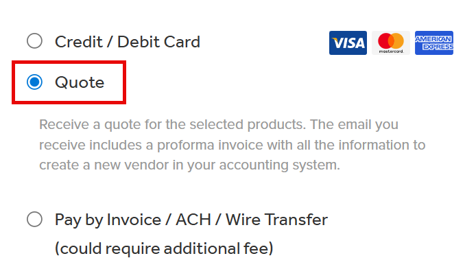
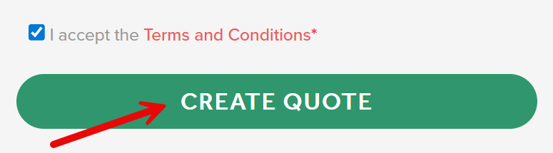

You can create a quote for a SQLBI service by following the steps below:_

1) Visit our [SQLBI training](https://www.sqlbi.com/training/) or [SQLBI consulting](https://www.sqlbi.com/consulting/) pages and choose the service you want to purchase.

2) Click on the **Enroll Now**, **Subscribe**, or **Add To Cart** button, depending on the service selected. 

3) Select the **Quote** switch close to the Order Details section. This will create a quote instead of an order. 

4) Complete the **Billing Details** section with the information of the person/company that receives the quote. This can be a name and company other than who will use the service.

5) If there are course extensions included in the cart, complete the **Extensions user** section with the email of the user(s) who has access to the course that you want to extend

6) If there is a **License manager** section, you should select who will manage the course licenses if they are not assigned in the quote.

7) In the **Additional services** section, you can select optional services to include in the quote:

  - Select **Vendor enrollment** if you need our company to fill special forms to be enrolled as a vendor in your system, like register on Ariba, SAP, etc.

  - Select **Additional documents** if you need additional documents like company's tax residency certificate.

8) Make sure that the products in the cart and their quantities are correct.

9) Make sure that the License Type is correct.

10) **Agree** to the terms and conditions. The option is not binding for the quote only, because you are not purchasing nor trying any service by simply requesting a quote. We just want to make sure you understand the Terms and Conditions for the quote.  

11) Click the **Create Quote** button to complete the process and receive an email with the quote. 

After you complete the quote request, you will receive an email with the quote information.