# TCDX

## Overview
The `TCDX.Metadata` library provides a structured representation of tabular model metadata, enabling standardized tracking of how Power BI, Excel, and SQL Server Analysis Services (SSAS) interact with tabular models. It defines the TCDX Object Model, which organizes metadata related to [`Consumer`](./Consumer.md), [`QueryGroup`](./QueryGroup.md), and [`ModelDependency`](./ModelDependency.md) items.

By leveraging `TCDX.Metadata`, developers and BI professionals can analyze:
- Which applications (Consumers) reference tabular models.
- How queries (QueryGroups) interact with tables, columns, and measures.
- Model dependencies, tracking key relationships within a dataset.

This library is designed to enable interoperability, improve governance, and enhance performance optimization across various BI tools.

---

## TCDX Object Model
The TCDX Object Model is structured around three key components:

### 1. Consumers
A [`Consumer`](./Consumer) represents an application that interacts with a tabular model, such as:
- Excel workbooks (pivot tables, Power Query).
- Power BI reports (DAX queries, visuals).
- Other business intelligence tools that access tabular data.

Each Consumer maintains:
- Metadata about the client application (e.g., Power BI, Excel).
- Items that reference tabular model components (pivot tables, visuals, etc.).
- Dependencies on tables, columns, and measures.

### 2. QueryGroups
A [`QueryGroup`](./QueryGroup) captures queries executed against a tabular model, including:
- Query sources (Power BI Query Analytics, SQL Profiler, Extended Events).
- Execution details (query count, duration, performance insights).
- Data dependencies (referenced tables, columns, and measures).

QueryGroups help in performance analysis, optimization, and data governance by tracking query execution patterns.

### 3. Model Dependencies
The Model Dependencies component provides insights into how Consumers and QueryGroups relate to a tabular model, tracking:
- [`ModelDependency`](./ModelDependency.md) → The referenced tabular model.
- [`TableDependency`](./TableDependency.md) → Tables accessed within the model.
- [`ColumnDependency`](./ColumnDependency.md) → Columns used in queries and reports.
- [`MeasureDependency`](./MeasureDependency.md) → Measures applied in calculations.

These dependencies help organizations understand model usage, optimize queries, and improve governance.

---

## Why Use TCDX.Metadata?
TCDX.Metadata provides a unified framework for managing tabular model interactions, supporting:
- Data lineage tracking, ensuring visibility into model usage.
- Query performance optimization, identifying slow or inefficient queries.
- Standardized metadata management, enabling cross-tool compatibility.
- Scalability, ensuring that metadata tracking can evolve with BI tool advancements.

TCDX.Metadata is a work in progress, designed to be extended and improved by the community, ensuring continued evolution and adoption across the Power BI and SSAS ecosystem.

---

## Conclusion
The `TCDX.Metadata` library provides a powerful, structured approach to managing tabular model metadata, helping BI professionals, data engineers, and developers gain deeper insights into model usage, query execution, and data dependencies. 

By standardizing tabular model tracking, `TCDX.Metadata` enables better governance, optimization, and interoperability across Power BI, Excel, and other BI tools.

🚀 Get involved and help shape the future of tabular model metadata management with TCDX!

The Model dependencies are represented with references to the [`VertiPaq Analyzer (VPAX) object model`](https://docs.sqlbi.com/vertipaq-analyzer/)

