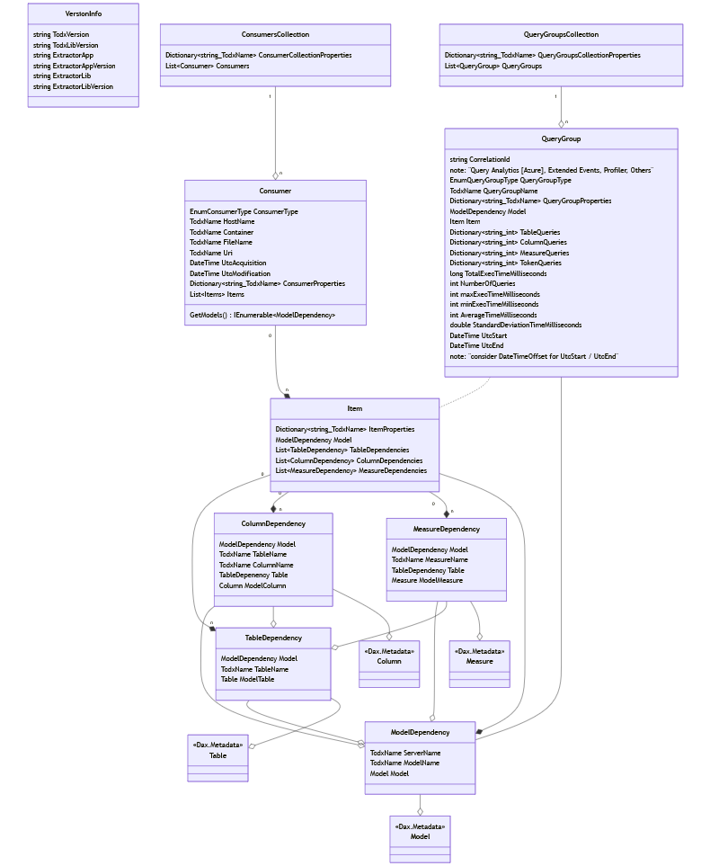

The Tcdx Object model cosist of two main entities, **Consumer** and **QueryGroup**, plus the VersionInfo

The **Consumer** represents a client who uses the Model, with the information of the referenced tables and measures

The **QueryGroup** represents a set of queries executed on the Model, with number of executions and duration information when available.

The Model dependencies are represented with references to the **[VertiPaq Analyzer](https://docs.sqlbi.com/vertipaq-analyzer/)** object model

