SQLBI provides on-demand video courses and other paid content with transferable or untransferable licenses - [see the difference](licensing).

By purchasing some products with a transferable license, you can access a special area of your account dashboard to manage the licenses and assign/revoke the access of your team to the products you purchased.

This guide explains:
- How to assign and revoke your licenses.
- How to use the auto-enrollment links, which are a convenient way to automate the management of large teams.
- How to generate authentication tokens for our licensing API.

> Do not hesitate to email us at [info@sqlbi.com](mailto:info@sqlbi.com) if you have questions that fall out of the scope of this guide, or if any typos are preventing your users from receiving their credentials.

## Access the License Manager
To access the License Manager, you need to have purchased a product with a transferable license. If you have purchased a product with a transferable license, you can access the License Manager by following these steps:

1. [Log into your account](https://www.sqlbi.com/account/).
2. Go to your **Licenses** section.
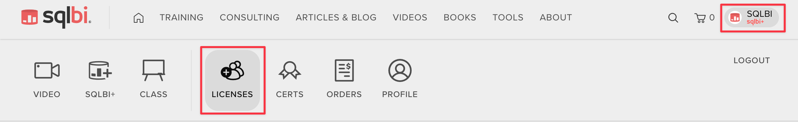

## Assign Licenses
You can assign your licenses by following these steps:

1. Go to the **Licenses** section.

2. Here you see the list of products that you have purchased licenses for. You may have purchased Transferable or Untransferable licenses – this will be indicated under the title of each product title. Licenses are grouped in pools.
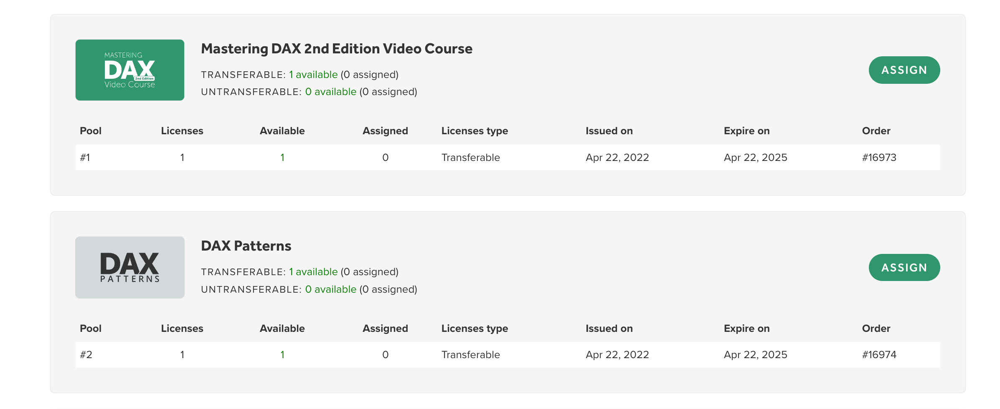
 	
3. Click on the **Assign** button. The dialog box below pops up.
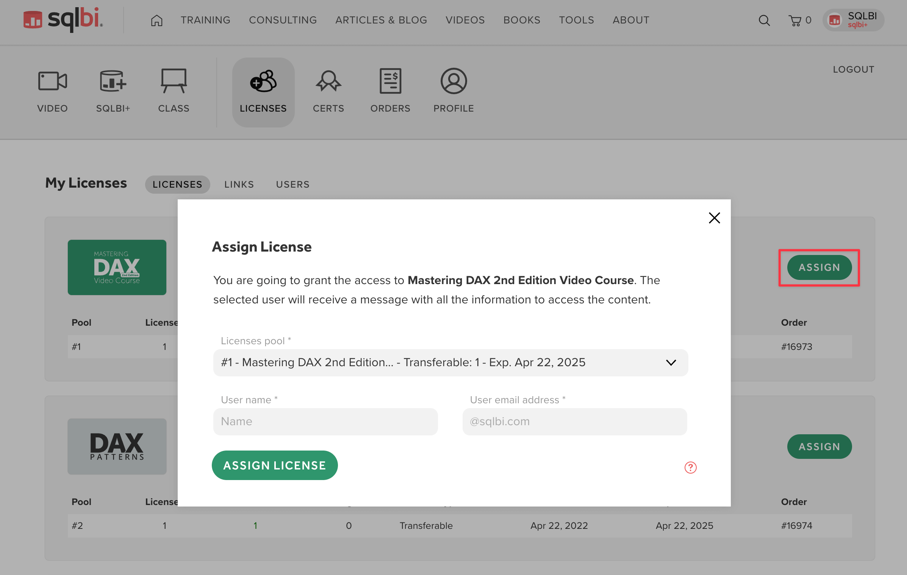

4. The expiry date under **Licenses pool** reflects the date of purchase, not the date the course is assigned. This window combines together both your Transferable and Untransferable license pools.

5. Pick the license pool you wish to assign from the drop down and enter the user's information.
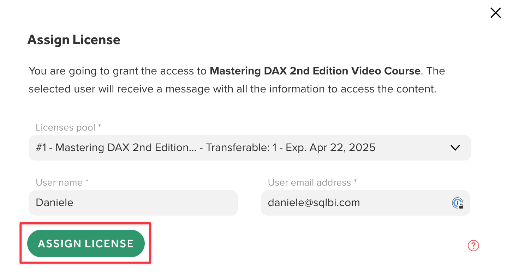
 	
6. Click on **Assign License**. An email is automatically sent to the user with their login details.
 	
## Revoke Licenses
You can revoke a transferable license by following these steps:

1. Go to the **Users** section to see the list of users that have had a license assigned to them directly.
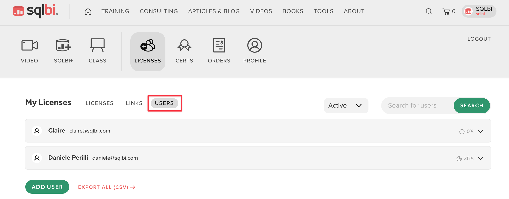

2. You see the progress they have made (in case the content is a video course), and you can expand for more information.
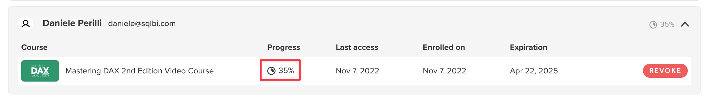

3. In case the user has a transferable license assigned, you can revoke it by pressing the **Revoke** button. The system will send an email informing the user that they no longer have access to the licensed content, and it frees the license to be assigned to someone else.
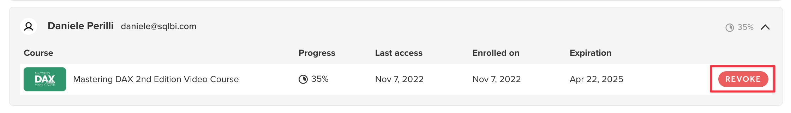

## Auto-Enrollment Links
In your account area there is a section that allows you to create auto-enrollment links. These are special links that users can use to have one of your licenses automatically assigned to them.

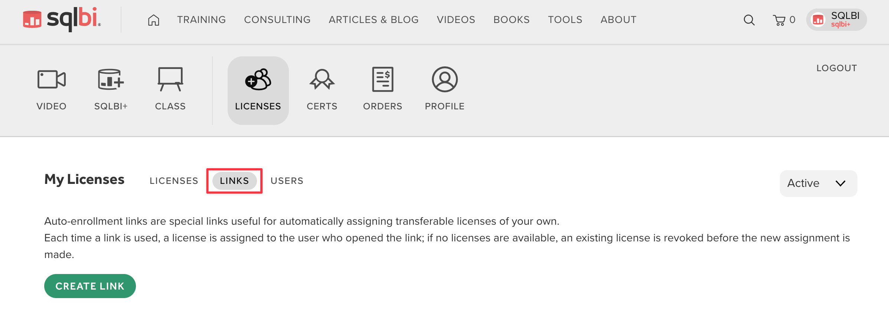

Using auto-enrollment links provides different benefits depending on the [type of license](licensing) you have purchased:

- **Untransferable licenses:** the auto-enrollment link allows you to let users register on their own. Useful if you purchase a high number of licenses and have not assigned them yet at the time of purchase. The license remains theirs until it expires.

- **Transferable licenses:** auto-enrollment links enable you to create a “library” that users borrow licenses from and return licenses to. The license manager has the option to:

    - Enforce the returning of the licenses for someone else to use;
    - Enforce the reassignment of a license to someone else after a certain period of time;
    - Auto-Reassign: once all the licenses have been assigned, if someone new applies for a license this will revoke the oldest license in use and assign it to the new user.

You can create auto-enrollment links by following these steps:

1. Go to the **Links** section.

2. Click on **Create Link**. This opens the following pop-up.
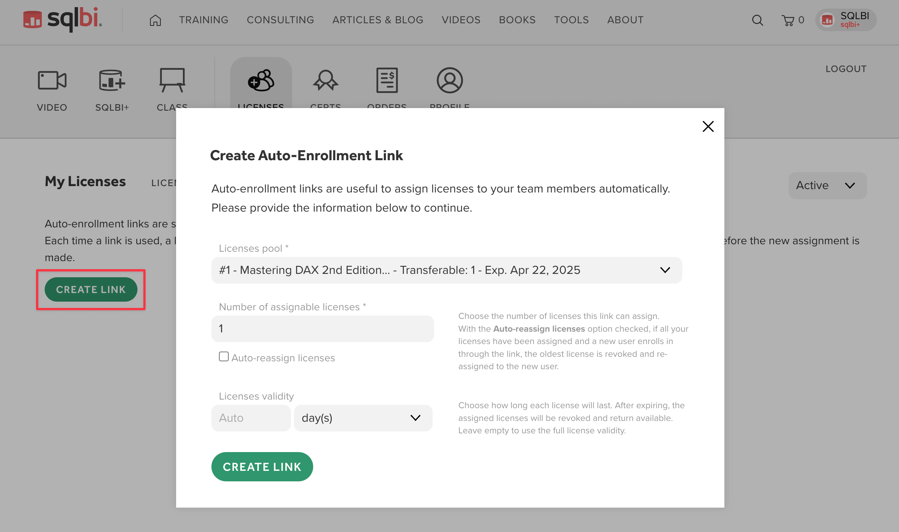

3. In the drop-down, decide which pool you want to pick these licenses from.
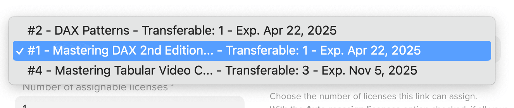  
We are focusing on Transferable Licenses for the purpose of this guide. This is where you customize your library. You decide how many licenses you are making available, for how long, and whether you want them to roll over from the oldest user in the queue to the newest, entering user. These are details you will need to communicate with users when making the link available to them.

4. Click **Create Link**.

5. You now have a link to send out to your team members. With Transferable Licenses, each time you create an auto-enrollment link you create a customized “library”.

6. Users who receive that link will be able to either create an account on on SQLBI or log into their existing account, and find the license available in their profile. This link and thus the library that it represents can be destroyed by clicking **Delete**.
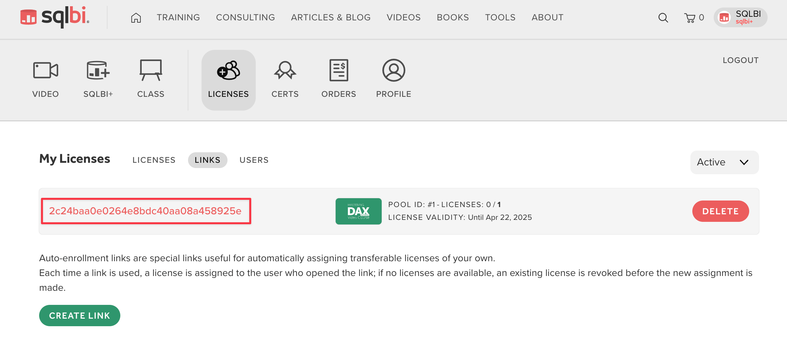

## Tokens for Licensing API

The [SQLBI Licensing API](../api/licensing/index) allows you to programmatically manage your licenses and students. To utilize the API, you must first generate an API token through the SQLBI License Manager interface. Here is a step-by-step guide to creating a new API token:

1. Go to the **API** section.
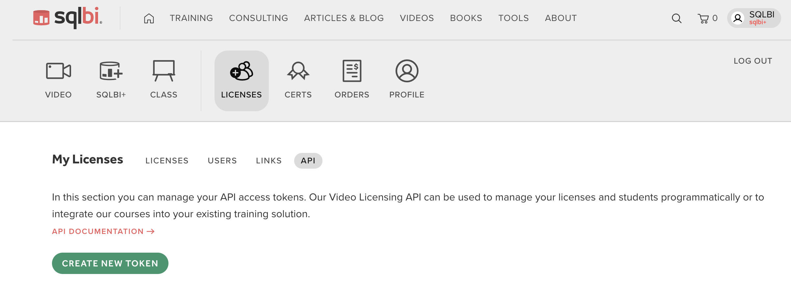

2. Click on the **Create New Token** button to begin the process of generating a new token.
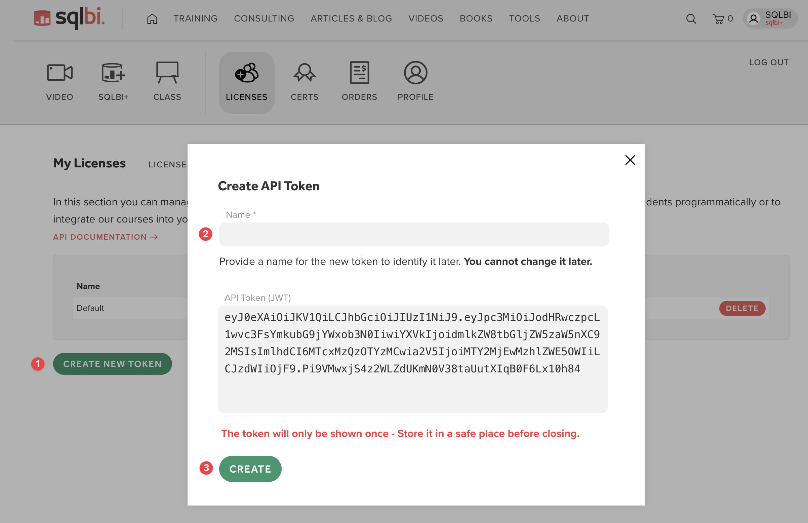  
In the *Create API Token* window, you will be prompted to give your token a name. This name is for your reference and will help you identify the token later. Please note that once set, the token name cannot be changed. A long string will be automatically generated; this is your API token. It is a JSON Web Token (JWT) that will be used to authenticate your API requests.

3. It is crucial to save your API token in a secure place immediately, as **it will only be shown once for security reasons**. If you lose this token, you will need to generate a new one.

4. After saving the token, click the **Create** button to finalize the creation process. 

> Remember to keep your API tokens confidential and use them securely, as they grant access to your SQLBI licensing information.

Once created, your new API token will appear in the list of tokens. You can create multiple tokens if needed and delete any that are no longer required by clicking the **Delete** button next to the corresponding one.

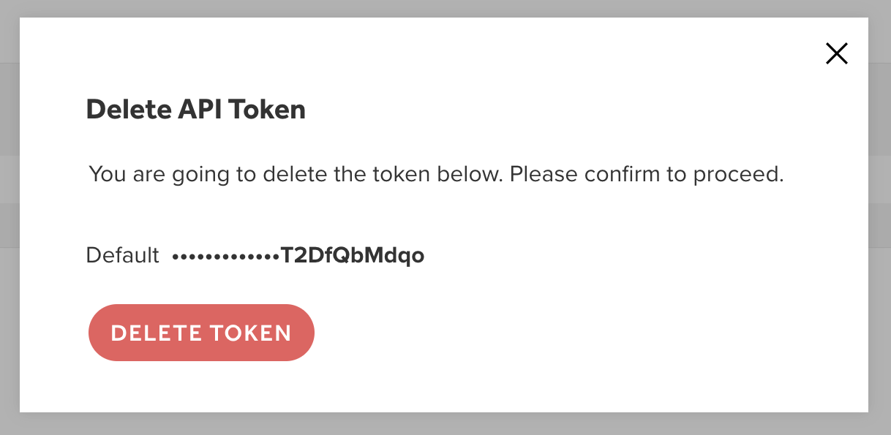  

Now you are ready to use the [SQLBI Licensing API](../api/licensing/index).
