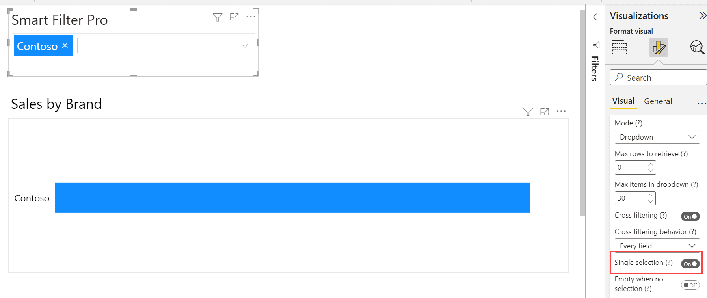
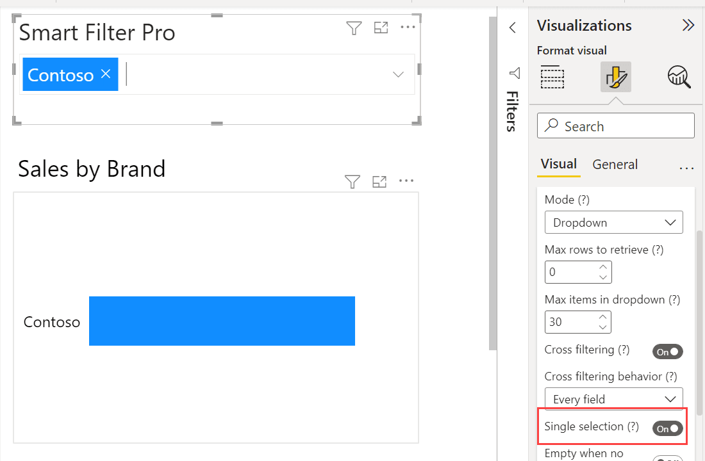
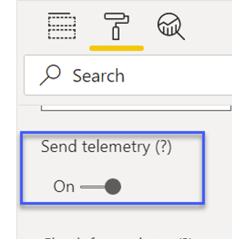
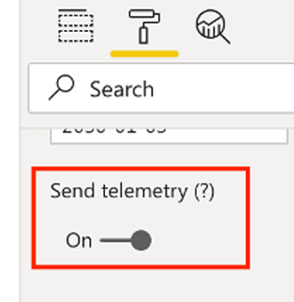

The following directions are required to keep this documentation clean and consistent.

### File Name

These rules apply to both folders, Markdown files and images:

- **Don't put spaces** or other special characters ***(_ & , ; : % $ " ' / \\ ? ! @)*** in file names.  
For example: ***this-is-a-new-file.md*** instead of ***this is a new_file.md***.
- **Use lowercase** file names.
For example: ***dropdown1.png*** instead of ***Dropdown1.png***.

### Content

- Use the [supported syntax](markdown-editing.md).

- Don't forget to update the **modified** attribute in the header of each file you edit.

- Use Camel Case (first character of each word capitalized) for titles.  
For example: **Best Practices** instead of **Best practices**.

- The label of links can be everything, but it is preferable to use a meaningful text like the title of the document to be linked rather than a generic call to action.  
For example: [Best Practices](best-practices.md) instead of [Learn more](best-practices.md).

- Use **bold italic** to refer to commands labels of the user interface.  
For example: `Click on the button ***Apply*** to proceed.`

- Use **code blocks** to refer to the user input.  
For example: <code>If you enter `audio`, then something happens.</code>

### Images

#### File Format

- **PNG is the preferred format for images**. 
- Use JPG only if the image is a photography.
- GIF images are supported, but their size get too big very quickly when you record something on the screen (screencasting).  

#### File Size

- Size lower than 50KB are best.
- The **max acceptable size for an image is 150KB**.
- **Always optimize the images** with a tool or a free service like [Tiny PNG](https://tinypng.com/). If you can't do it, send them us before committing.

#### File Resolution

- Use images with the highest possible resolution (respecting the file size constraint) - **at least double the size in which they are presented**. For example: if you plan to insert an image with the width attribute equal to 200, the actual image width should be at least 400px.

- **Don't provide images with width/height with an odd number of pixels**. This may create blur when the image is resized by the browser. For example: if your image is large <b class="bad">411px</b>, you need to resize it to <b class="good">410px</b>.

#### &lt;img&gt; Width

- When you insert an image in a document, you must define a ***width*** attribute (see the [Markdown Syntax](markdown-editing.md)) - choose a number of pixels that allow the end users to read the relevant information of the document in which they are placed. In case of screenshots, try to keep the actual size of the user interface.
    > Note that whatever width you choose, it cannot exceed the width of the parent container, but don't worry, an automatic rule will be applied to prevent this. 

    > The height of the images is automatically calculated to keep the aspect ratio - you don't need to provide it.

#### Blank Space 

- **Avoid leaving too much blank space** in screenshots. If possible, resize the UI focusing on the relevant area of the image.

    <table>
        <tr>
            <th class="bad">Bad</th>
            <th class="good">Good</th>
        </tr>
        <tr>
            <td>
                
            </td>
            <td>
                
            </td>
        </tr>
    </table>

    As you can see, both images are the same width (400px) but the ***Good*** version is more readable because we have resized the chart and removed the unnecessary blank space.

#### Sequential Screenshots

- When you take multiple screenshots of the same interface just to highlight minor changes, **each screenshot must be the same width** and every element that doesn't change between images must be in the same location.

#### Highlighting Shapes

- Use <b style="color:red">rectangles or arrows in red</b> to highlight relevant areas in screenshots.

- If there are multiple shapes and you need to highlight the steps to follow in sequence, **number the shapes**.

    

- **Don't apply shadows** to highlighting shapes.

    <table>
        <tr>
            <th class="bad">Bad</th>
            <th class="good">Good</th>
        </tr>
        <tr>
            <td>
                
            </td>
            <td>
                
            </td>
        </tr>
    </table>

#### Mouse Cursor
- **Don't capture the mouse cursor** in screenshots.

