This document explains the workflow to edit this documentation (**docs**). Note that:
- The files consisting of the docs are hosted on Github at this URL (**repo**):  
    <{{ site.github }}>  
- We use Github to edit, review and manage documents, but despite the repo being publicly accessible, end users will browse the docs at this URL (**website**):  
    <{{ site.url }}>

## Workflow

To edit the docs you need to follow the steps below:

1. **Create a Github Account**:  
    You can create a Github account at this URL: <https://github.com/join>  
    Follow the on-screen directions, activate your account, then provide us your username, so we can invite you as a repo collaborator.

2. **Setup**:
    1. [Install Git](#install-git)
    2. [Install VSCode](#install-vscode)
    3. [Clone the Repo](#clone-the-repo)  

3. **Make Changes** (for authors):
    1. [Synchronize your Local Copy](#synchronize-your-local-copy)
    2. [Create a Branch](#create-a-branch)
    3. [Make your Changes](#make-your-changes)
    4. [Commit your Changes](#commit-your-changes)
    5. [Create a Pull Request](#create-a-pull-request) 
    6. *(optional)* [Edit the Pull Request](#edit-the-pull-request) 
    7. [Delete the Branch](#delete-the-branch) 

4. **Approve Changes** (for reviewers):
    1. [Review the Pull Request](#review-the-pull-request)  
    2. *(optional)* [Change the Pull Request](#change-the-pull-request)
    3. [Merge the Branch](#merge-the-branch)
    4. [Delete the Branch](#delete-the-branch-1)

### Setup

You need to follow the steps below only the first time.
1. #### Install Git

    Download Git from <https://git-scm.com/> and install it using the default options.

    After installing it, you need to configure your Github account. Here is how:

    1. Open Command Prompt (or Terminal on Mac).
        The easiest way to do that is from the search tool in the ***Start*** menu - search for ***cmd*** and click on the first result.
        
        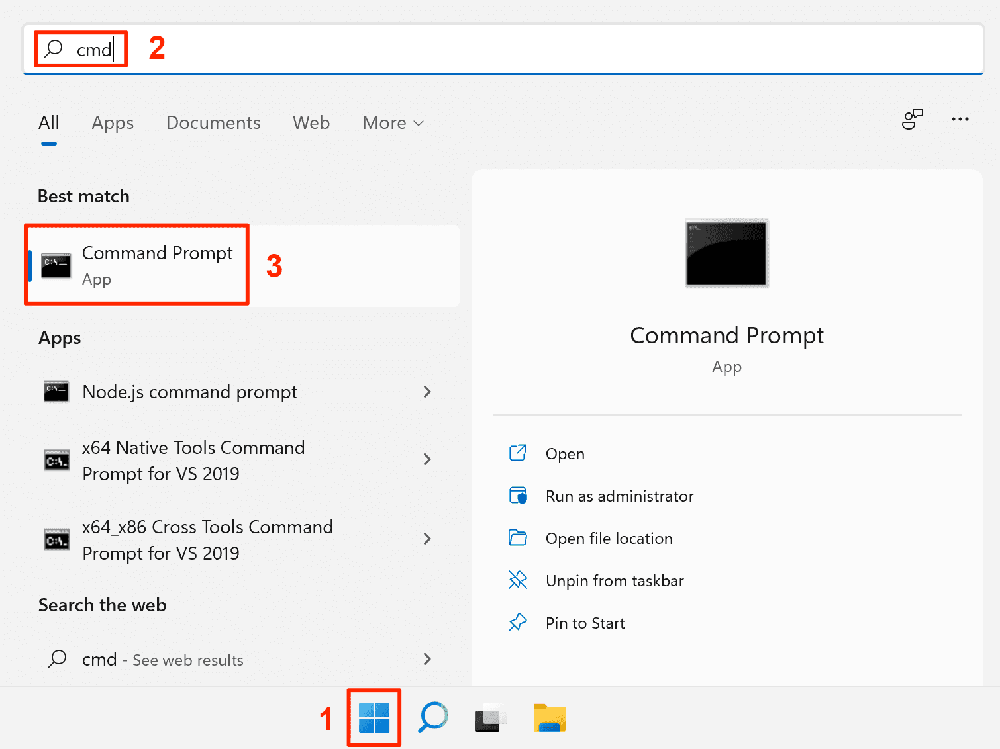

    2. At the command prompt, enter the following commands (replace ***your-email@domain.com*** and ***your-username*** with the ones you registered on Github): 
        - `git config --global user.email "your-email@domain.com"` (press Enter)
        - `git config --global user.name "your-username"` (press Enter)

        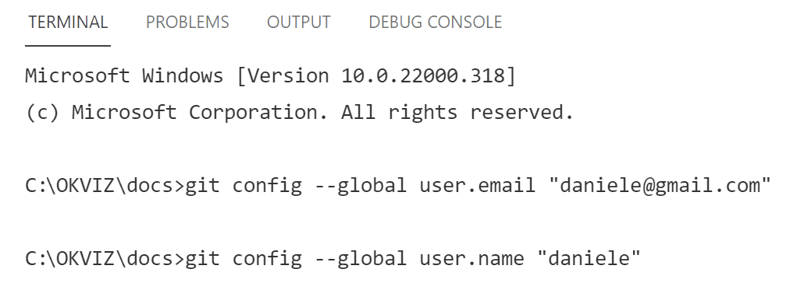
    
2. #### Install VSCode

    While it is possible to edit repo documents directly through the Github website, it's easier to use a desktop tool such as Visual Studio Code (**VSCode**). 

    Download VSCode from <https://code.visualstudio.com/> and install it.

3. #### Clone the Repo

    Cloning a repository means creating a local copy of a remote repository on your computer. You can make any changes on your local copy, and then send those changes back online through a **Commit**.

    To clone the repo, open VSCode, click on the ***Clone Repository*** button in the ***Editors*** sidebar, and insert this repository URL: `https://github.com/sql-bi/docs.git`

    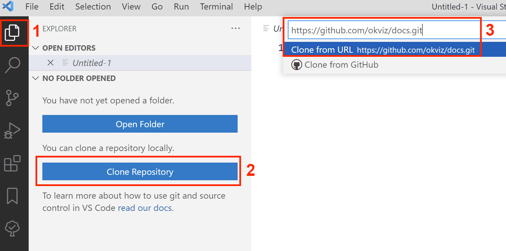

    After inserting the URL, you are asked to choose a folder on your computer to store the content of the copy of the repo. Create a new one and press ***Select Repository Location***. 

    At this point, VSCode downloads all the content from the repo online to your local folder and you're ready to start.  

    Click ***Open*** and ***Trust the authors*** in the pop-ups that appear.

### Make Changes

You have to follow the steps below every time you want to make changes to the docs in a session. 
A session starts with synchronization and ends with a Pull Request.

1. #### Synchronize your Local Copy

    The first thing to do is to synchronize your local version of the repo with the online version, to include any changes made by the other contributors.

    In VSCode, click on the source control icon, select the ellipsis button, and choose the ***Pull*** command from the context menu. 

    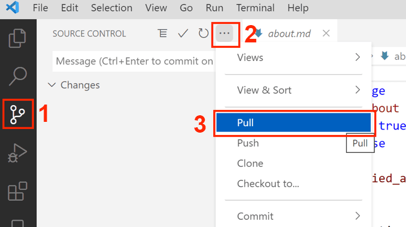

2. #### Create a Branch

    Now that you have the latest content on your computer, you need to create a new branch.  
    All documents accessible by the end users on the website are stored in the ***main*** branch of the repo - to make the review of your changes easier you need to copy this branch into a new one.

    Treat this new branch like a patch - a group of changes you want to apply to the ***main*** branch at the end of the current session.  

    > After the end of the session and the approval of the related Pull Request, **this branch will be deleted** (more later).

    To create a new branch, click on the  ***main*** label on the lower-left corner of the VSCode window. Then click ***Create new branch...***, and enter a name in the format `username-YYYY-MM-DD` (replace ***username*** with your Github username and ***YYYY-MM-DD*** with the current date in ISO 8601 format).

    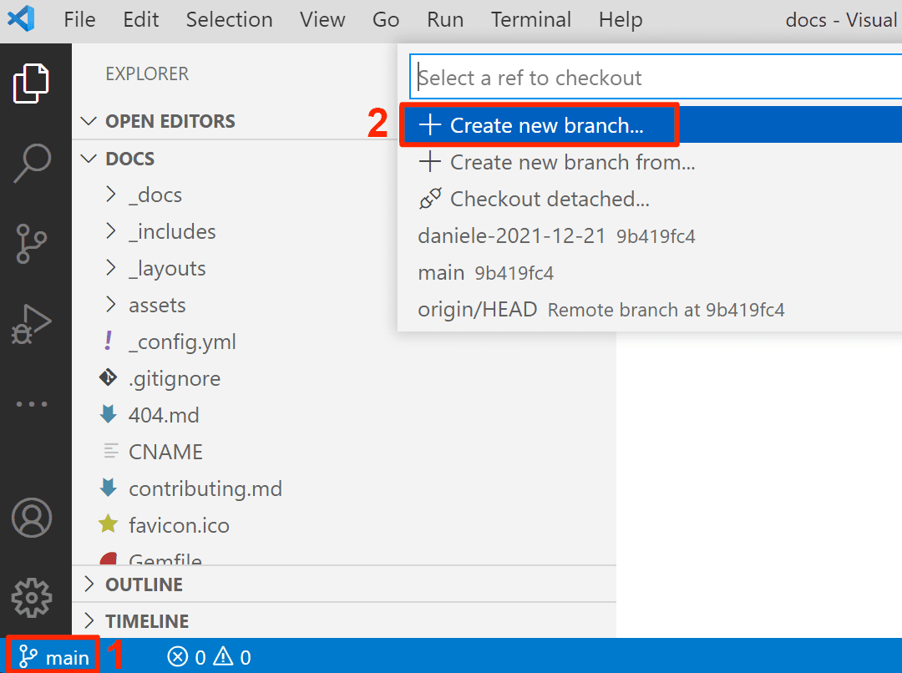

3. #### Make your Changes

    At this point, you are working on a different branch. You can see the name of the branch you have just created in the lower left corner of the VSCode window - if the name is still ***main***, click on the name and select the correct one.

    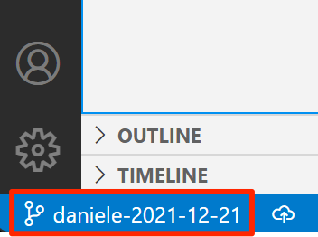

    The only place containing documents you may want to change is the **_docs** directory:

        _docs
            analyze-in-excel
            bravo
       

    > **IMPORTANT**: Don't change any files outside of the ***_docs*** directory.

    You can create files or folders directly in VSCode by right-clicking on the sidebar and choosing the appropriate command, and you can edit a file by left-clicking on it in the sidebar. 
    
    The files in the _docs directory are written in Markdown (file extension ***.md***) which is a simplified version of HTML. Editing a Markdown file is easier if you also open the preview pane - any changes in Markdown are interpreted and displayed in the preview pane in real time.

    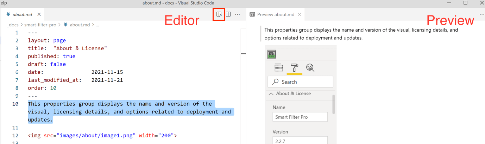

    See [Markdown Editing](markdown-editing) and [Best Practices](best-practices) to learn how to properly format your content. 

    After editing the files, save them and you are ready for the next steps.

4. #### Commit your Changes

    Committing a change means sending the files you changed locally back to the online repo. Indeed, before you commit them, all changes are stored only on your local computer.

    To commit with VSCode, click on the ***Source Control*** icon, add a small description of the changes made in the input box above the ***Changes*** section, click the ellipsis button and choose Commit (or CTRL + Enter).

    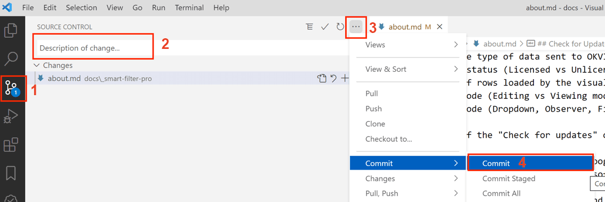

    If VSCode asks if you want to stage your changes, click on ***Always***.

    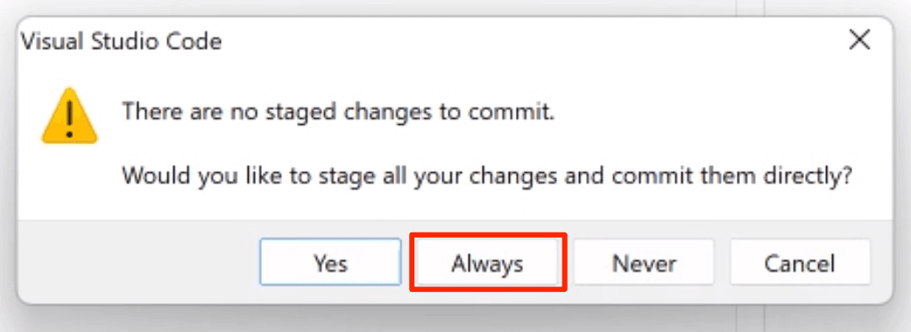

    Then click ***Publish Branch*** (or ***Sync Changes*** if you are following this step after sending the Pull Request - more later).

    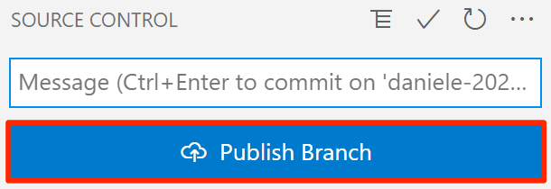

    > The first time you commit something, VSCode needs to be authorized to access your Github account. Click on **Sign in with your browser** on the dialog box that appears, and follow the on-screen instructions to proceed.  
    > 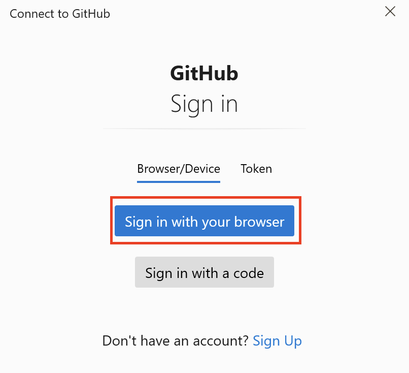

    

5. #### Create a Pull Request 

    At this point your changes are online on another branch, not visible on the website. You want to make them available to everyone, but you can't commit them directly to the ***main*** branch because every change requires approval. To request approval, you need to create a Pull Request (**PR**).

    First of all, go to the repo on Github (<https://github.com/sql-bi/docs>), ***Sign in*** if you are not logged in, then click on ***Compare & pull request*** button that should appear on top of the files list.
    
    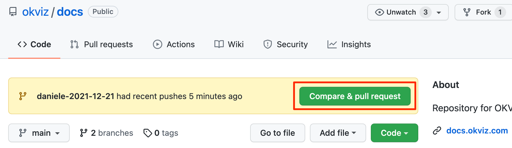

    On the next page, you can add more details to the request you are making and you can review all the changes you made. Also, note the top bar with the merge information - you are asking to merge your patch branch into the main branch.

    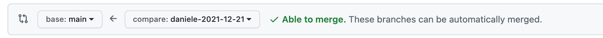

    If everything looks fine, press the ***Create pull request*** button.

   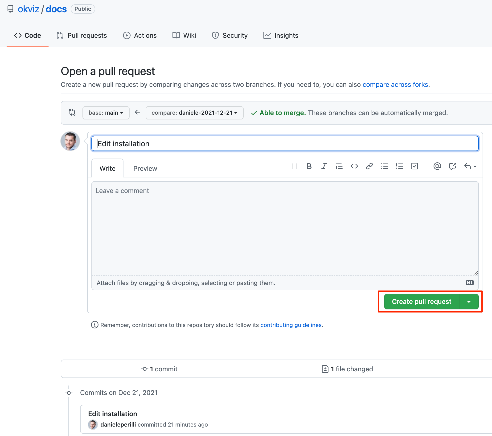

   At this point, the repo owner and the collaborators will be notified of your PR and may decide to approve it, request more details, or discard it.

6. #### Edit the Pull Request

    *(Optional)*  

    In case the reviewers request a change to your PR, you will be notified through an email from Github.

    To make a change in the PR:

    1. Open your local copy of the repo with VSCode.

    2. [Synchronize your local copy](#synchronize-your-local-copy).

    3. Verify that the current branch is the same branch you created for the PR (you can see the name in the lower left corner of the VSCode window - if the name is different, click on it and select the correct one).

        

    4. Make your changes.

    5. [Commit your changes](#commit-your-changes).

    There is no need to create a new PR or notify the reviewers, everything is handled automatically by Github.

7. #### Delete the Branch

    **After receiving a notification that the PR has been approved**, you need to switch back your local repo to the ***main*** branch, and delete the patch branch.
    To do this, click on the patch branch name in the lower left corner of the VSCode window and select ***main*** from the dropdown list. 

    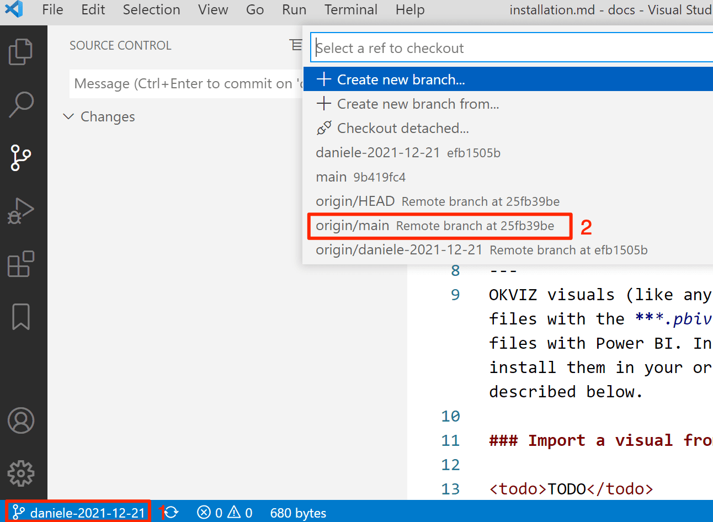

    At this point, click on the source control icon, select the ellipsis button, choose ***Branch***, then ***Delete Branch...***, and select the patch branch name.

    > **IMPORTANT**: Don't delete the patch branch until the PR has been approved or closed.

    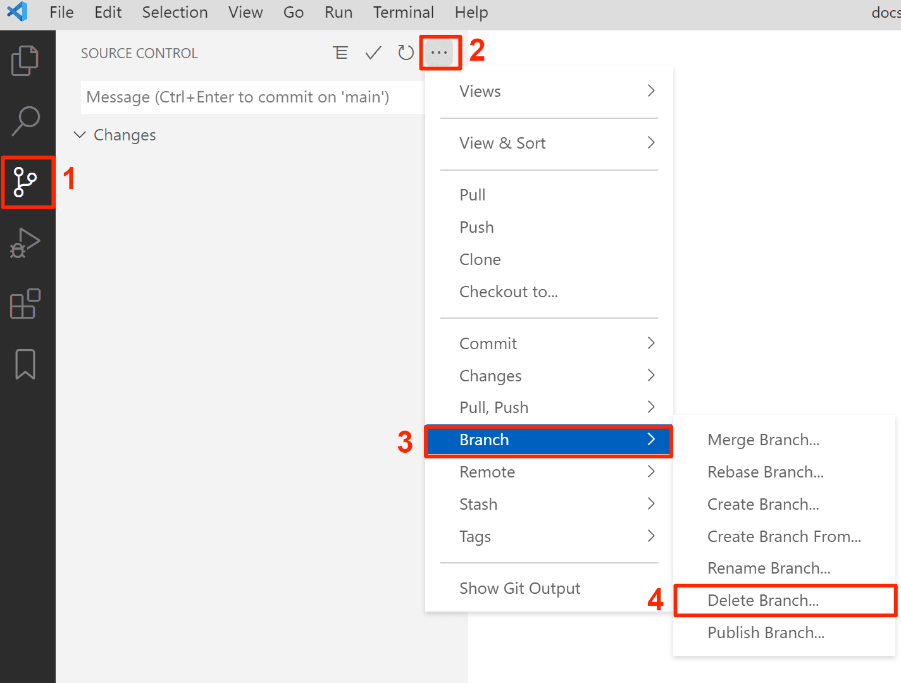

    If VSCode shows more than one branch with the same name, **select all** and proceed, we don't need these copies anymore.

*You are done, congratulations!*  

### Approve Changes

These steps are for reviewers only. They must review the Pull Request, approve it (or request changes), and delete the patch branch created online by the contributor.

1. #### Review the Pull Request

    To review the PR, open the repo on Github, click on [Pull requests](https://github.com/sql-bi/docs/pulls) and select it from the list.

    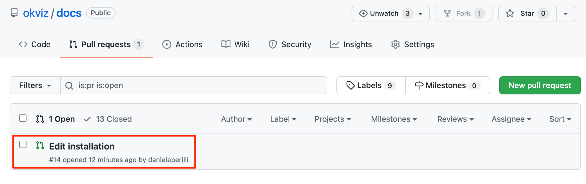

    On the next page you can see that the PR requires at least 1 approving review to be merged into the main branch. To proceed, click on ***Add your review***. 

    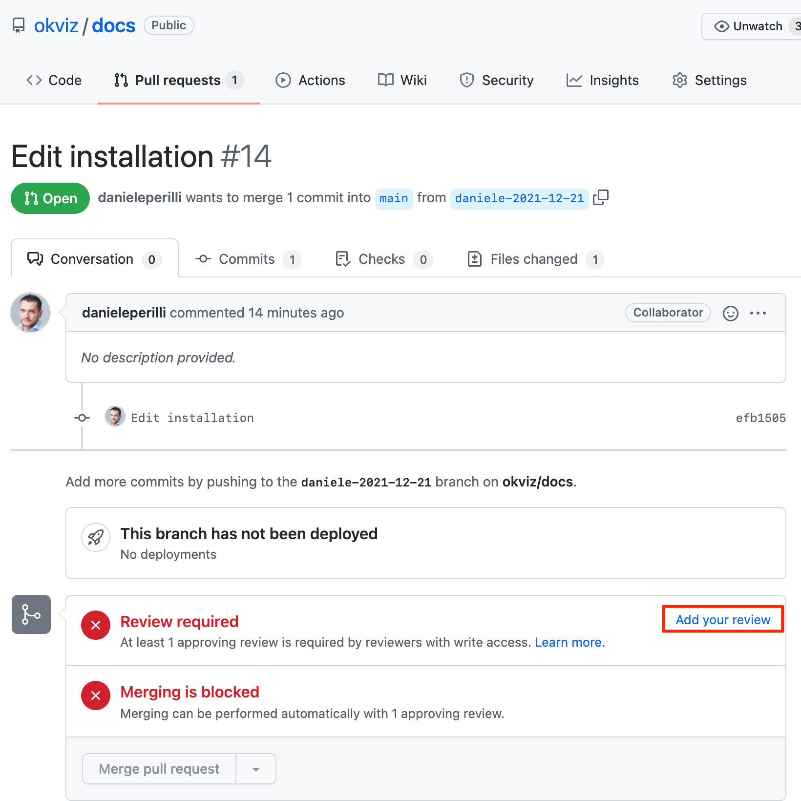

    Here you can see all the changes included in the PR and decide to approve them from the ***Review changes*** dialog box. 

    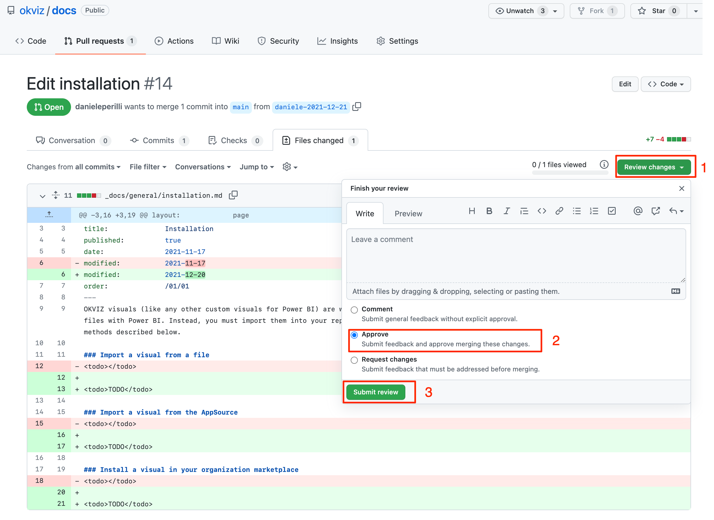

    If you want to request changes from the author, click on ***Request changes*** and leave a comment. The author will be notified of your comments.

2. #### Change the Pull Request

    *(Optional)*  

    If you want to apply some changes to the files included in the PR and bypass the author, you can do this in two ways:
    
    - **Change Files in Github**

        Click the ellipsis button of the file you want to edit and choose ***Edit file*** from the context menu.

        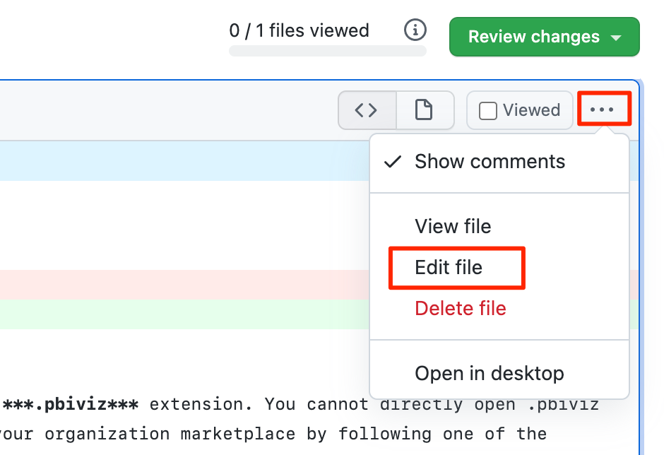

        > Note that the ***Edit File*** button may sometimes be disabled. This happens because you probably clicked somewhere and got placed into a different branch by Github. In this case, simply click on the PR as you did in the first step of this section, then click on the file you want to edit and the button should be enabled again.
        
        See [Markdown Editing](markdown-editing) to learn the supported syntax for content editing.

    *- Or -*

    - **Change Files in VSCode**

        Another way of directly changing the files of the PR is to use VSCode.  
        The procedure is similar to what the authors do to make changes to the repo, with some differences:

        1. [Synchronize your Local Copy](#synchronize-your-local-copy)

        2. **Switch to the PR Branch**

            Since the branch created for the PR is public, you can switch to it and make changes even if you are not the original author. Any changes made there are automatically reflected in the Pull Request.

            First you need to know the name of the branch used by the author of the PR. It's at the top of the Github review page.

            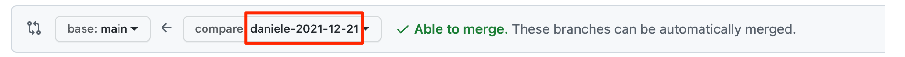

            Now, in VSCode change the current branch from the lower left corner of the window. Click there and select the PR branch name from the dropdown list. 

            
           
           You are now ready to make changes.

        3. [Make your Changes](#make-your-changes)

        4. [Commit your Changes](#commit-your-changes)

    
    After committing the changes, you need to approve the PR as described in the previous step.

3. #### Merge the Branch 
    
    After approving the PR, you can merge the changes into the main branch. To do this, click ***Merge pull request*** and confirm.

    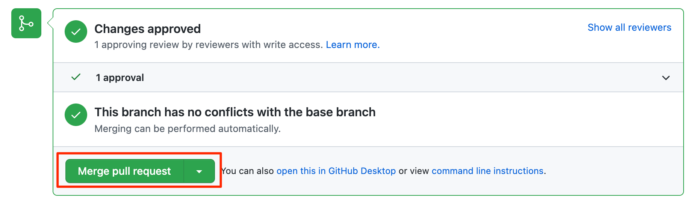

4. #### Delete the Branch

    After the PR has been merged into the main branch, the patch branch must be deleted. Press the ***Delete branch*** button next to the merge confirmation message.
    
    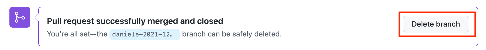

*You are done, congratulations!   
The changes will be visible on the website in a couple of minutes. If the changes do not appear, contact the administrator who will force the update manually.* 

## Content Editing

See [Markdown Editing](markdown-editing) to learn how to properly format your content.
## Best Practices

Follow the [Best Practices](best-practices) to keep the docs clean and consistent.
